# Movie Fav

Movie Fav is an social network platform specially designed for people who like movies and series. With it's user-friendly interface, Movie Fav offers a nice space for users to document and share their thoughts of movies, series and everything around, which is shown with pictures and words.

In addition to sharing their interest, users can actively engage with the community by liking and commenting on posts. Movie Fav provides a user-friendly "follow" feature, enabling users to effortless stay connected with their favorite content creators.

In summary, Move Fav is a platform that integrates social networking with movie enthusiasts.

Movie Fav is a fictional website created as a milestone project 5 for Code Institutes fullstack developer course. 

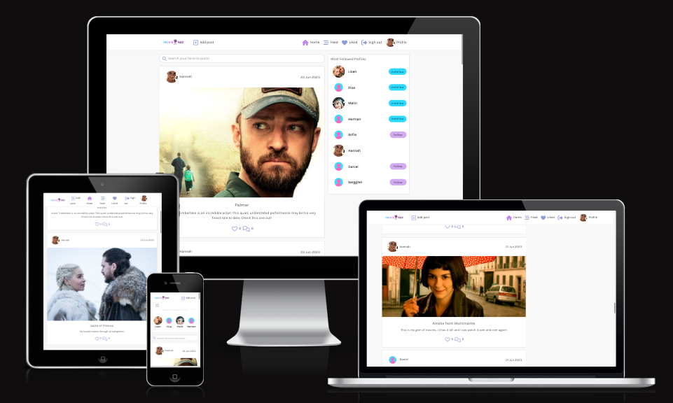

## Live website
View live website here: [Movie Fav](https://moviefav-1a8485e84849.herokuapp.com/)

## Table of contents

- [Movie Fav](#movie-fav)
- [Live website](#live-website)
- [Project](#project)
    - [Objective](#objective)
    - [Site user goal](#site-user-goal)
    - [Site owner goal](#site-owner-goal)
- [Project management](#project-management)
    - [Github project board, user stories, issues and milestones](#github-project-board-user-stories-issues-and-database-diagram)
    - [Wireframes](#wireframes)
- [Typography and color scheme](#typography-and-color-scheme)
    - [Typography](#typography)
    - [Color scheme](#color-scheme)
    - [Imagery](#imagery)
- [Features](#features)
    - [Existing features](#existing-features)
    - [Future features](#future-features)
- [Technology](#technology)
    - [Languages](#languages)
    - [Frameworks](#frameworks)
    - [Other software and libraries](#other-software-and-libraries)
- [Testing](#testing)
    - [Automated tests](#automated-tests)
    - [Manual testing](#manual-testing)
        - [Browser test](#browser-test)
        - [Lighthouse](#lighthouse)
    - [Bugs](#bugs)
- [Deployment](#deployment)
    - [Github & Gitpod](#github--gitpod)
    - [Create a React project and app](#create-a-react-project-and-app)
    - [Heroku](#heroku)
- [Credits](#credits)

# Project

## Objective
The objective of this project and website was to create a fifth portfolio submission for Code Institutes fullstack developer program. Among following the projects assessment criteria, the website needed to be built using React, JSX (HTML, JavaScript and CSS) and appropriate frameworks and libraries, and connected to a separate [backend API](https://movie-fav-project-5.herokuapp.com/). The application needed to have complete CRUD (create, read, update and delete) functionality on the Front-End for users to work with data from an API.

I've chosen to create a project aimed toward my own interests to find inspiration, and chose to create a social networking website targeted towards movie and series. 

**The project is partly based on the Code Institute Moments course material**, using some of the code provided there, with additional styling added by me. 

## Site user goal
Users of Movie Fav could have several goals, such as wanting to share and take part of movie posts, networking through the comments and follow content pandering to their interests. Users can also use Movie Fav to get inspired and get tips of what has been missed in the film and series world.

## Site owner goal
As a site owner the goal is to provide a enjoyable user experience, that encourages user interaction. The website should be accessible and appealing and contain content that is well structured with high standard. Site administrator should make sure the content is monitored to meet community standard.

# Project management

## Github project board, user stories, issues and database diagram
Movie Fav was developed using an agile methodology, using Github issues to track tasks during the project.

Movie Fav consists of a number of user stories, labeled to keep them easily organized.

- [User Stories](https://github.com/HannaBerggren/Movie-Fav/issues)
- [Project Board](https://github.com/users/HannaBerggren/projects/7/views/1)

### Database Diagram
The relationship between all of the models.
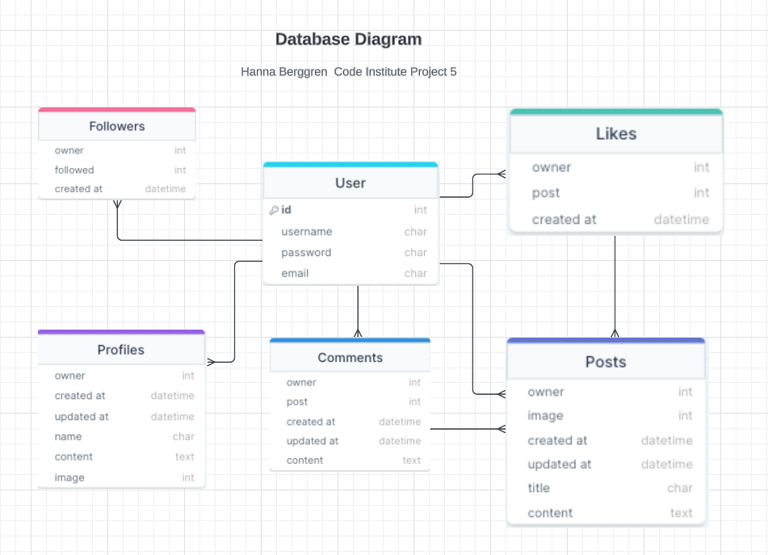

## Wireframes
Wireframes created using [Balsamiq](https://balsamiq.com/) to plan the general flow and display of Movie Fav. Some differences may be found between the original wireframes and the finished site due to design choices made during the project process.

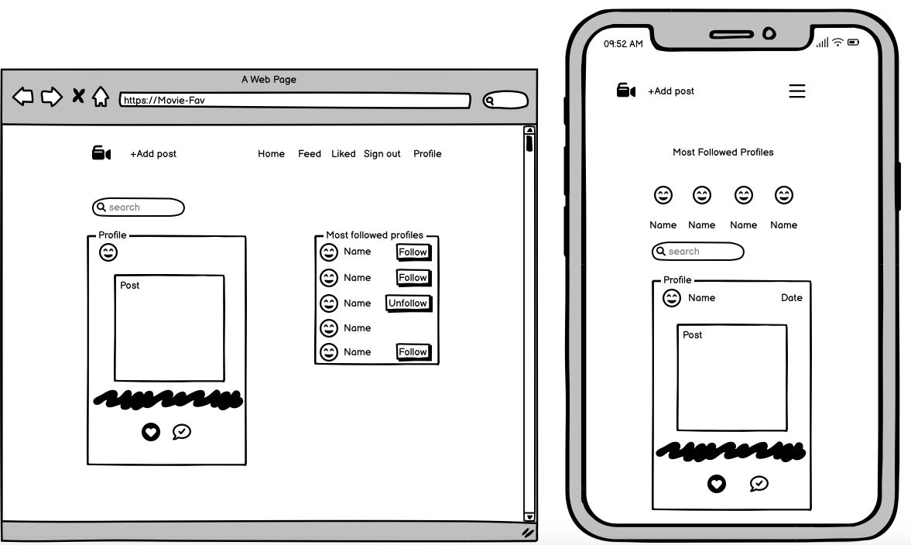

# Typography and color scheme

## Typography
Font used throughout the website is Karla with Lato for backup, imported from [Google fonts](https://fonts.google.com/?query=Karla).

## Color scheme
Color scheme is design to suit all ages and a mix of blue, purple and pink shades to match the project's logo.

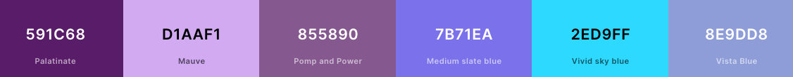

## Imagery
Images are imported from [Google](https://www.google.com/). No result image is imported from [Flaticon](https://www.flaticon.com/). Logo is imported from [Looka](https://looka.com/). Favicon is generated from logo image through [Favicon generator](https://www.favicon-generator.org/). 

# Features

## Existing features

### Navbar
Movie Fav feature a navbar that is present on all pages of the site. The navbar links change depending on wether the user is signed in or not, giving the user access to different features of the site. If the user is not signed in, the navbar show links to the sign in or sign up pages. If a user is signed in, the navbar shows the users profile avatar image (linking to the users profile). The navbar also feature the Movie Fav logo. 

### Sign up
To sign up to Movie Fav the user will need to fill out a form with preferred username and password. After submitting the form with valid data they are redirected to the sign in page. The page features a link to the sign in page, if the user is already signed up with Movie Fav. 

If the user tries to submit an invalid form (already existing username, password too short or similar to username, missed to fill out a field) they are notified by a message to correct their submission. 

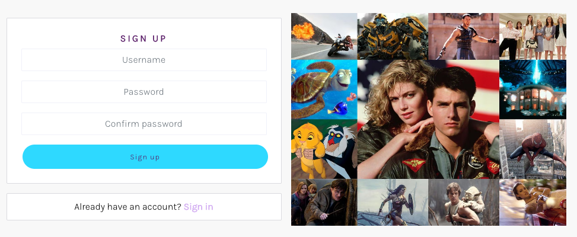

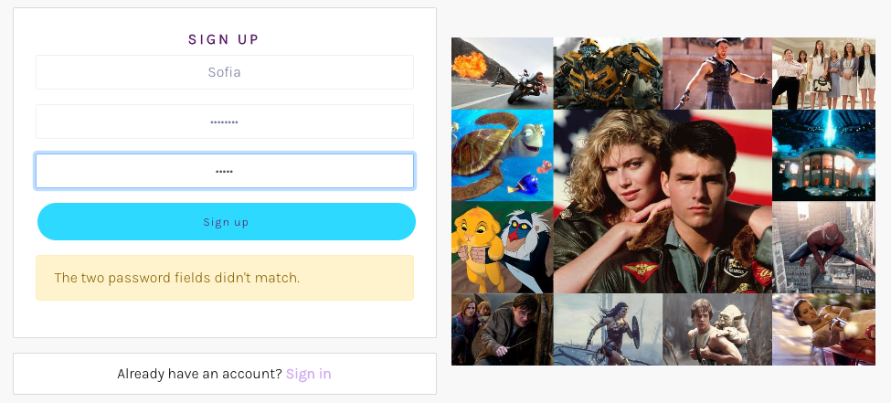

### Sign in

After signing up with Movie Fav a user can sign in by filling out the sign in form. When submitting a valid form they are redirected to the home page. 

If the user tries to submit an invalid form (wrong username or password, blank field) they are notified by a message to correct their submission. 

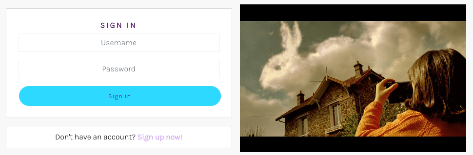

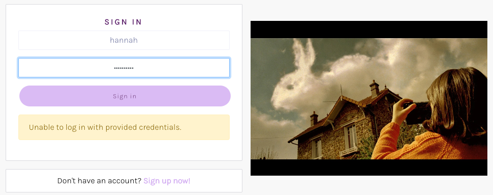

### Post feed
Users posts are displayed in the post feed on the home page, sorted by latest posts by all users. The feed features infinite scrolling, as long as there is content, the user can scroll further down. 

Clicking on the comments icon will redirect the user to a detailed view of the post and it's commentfield. 

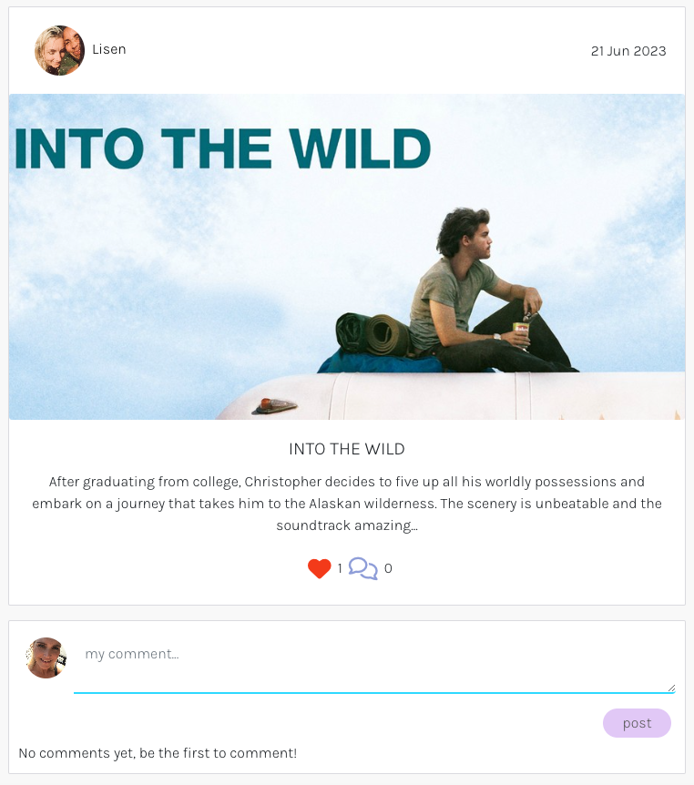

### Add a post
Users can add a new post through a form, with title, content and an image. The post is displayed in the post feed and in the users profile post feed.
The cancel button redirects the user back to the previous page and no post is made.

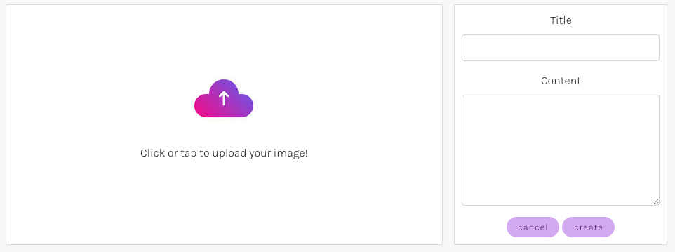

### Popular profiles
The popular profile section features the users with most followers, to let other users easily find new interesting content. This section is responsive, displaying differently on large and smaller screens. Clicking the `Follow` button saves the posts by that user in the `Followed` section.

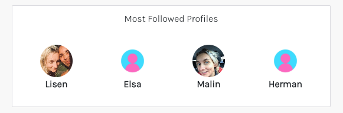

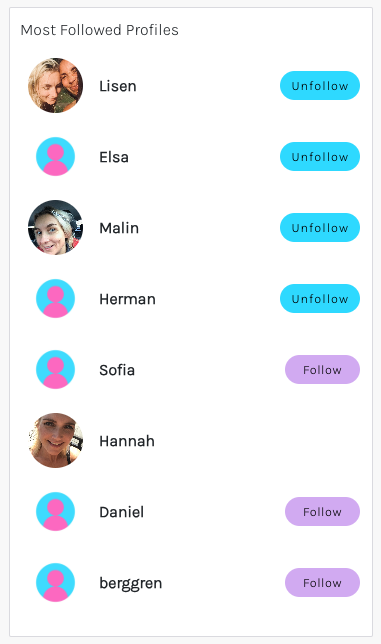

### Follow - Followed
By clicking the `Follow` button, either in the Popular profiles section or in a users profile bio will let users follow each others content, having the followed users posts display on the Followed page. Clicking `Unfollow` will let users stop following a user and remove their posts from the Following feed.

The amounts of followers and following for a user can be seen in their profile bio. 

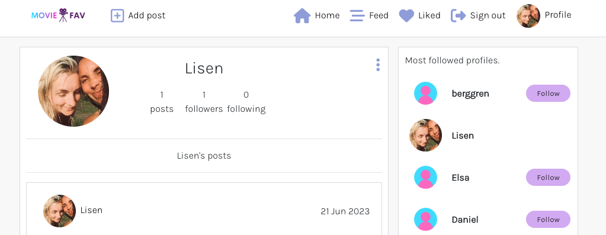

### Searchbar
Following profiles and find different objects feature a searchbar for easy navigation. If no match to searchquery can be found, a No results image and a message is displayed. 

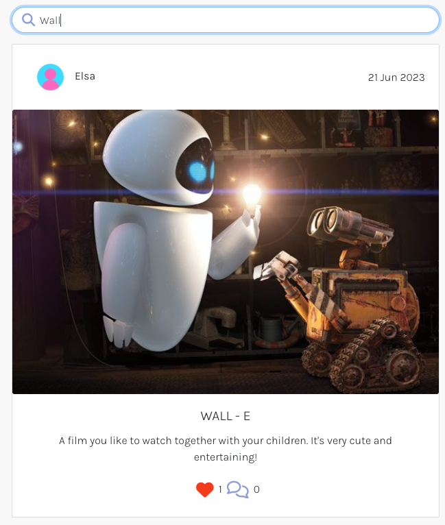
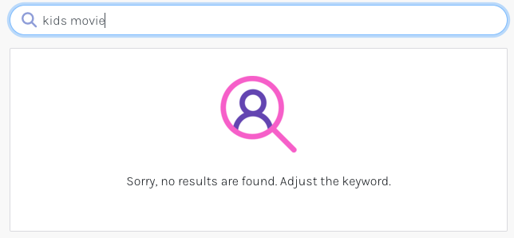

### Profile page
Clicking the avatar image or username in the navbar redirects the user to their own profile page. Here they can view all their own posts, add a bio and profile image, see how many posts they've made, how many users they follow and how many follow them. If you click on the dropdown menu, the user can edit their username, password and bio. 

If a user tries to edit their username to an already existing one they will be notified. If they try to change their password to an invalid one they will be notified. 

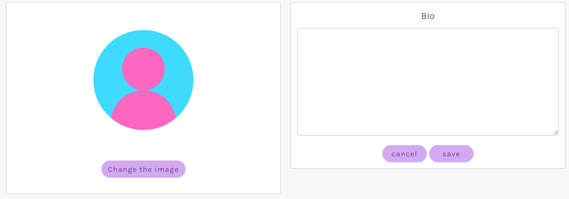
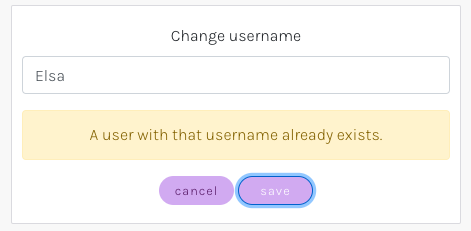

### Like - Liked entries
By clicking the heart icon on a post a user can like the post or click again to undo.

User can not like their own post, and are notified if they try to click the heart icon on their own post. 

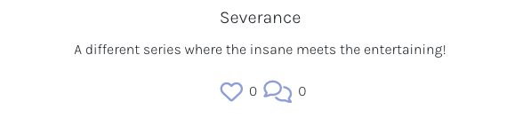
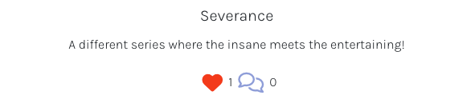
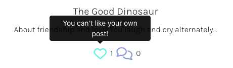

### Comments
Users can comment on posts through the commentfield. When posting a comment the comments count on the post is increased, and decreased if a user deletes their comment.

Only the user who posted the comment can edit or delete it.

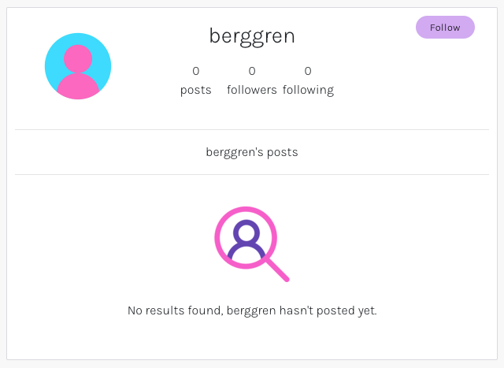
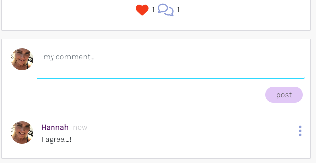
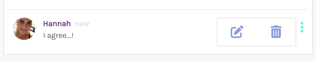

### Page not found
If the user tries a url that dont exist on Movie Fav, they are redirected to a `Page not found`, which let them redirect back to the homepage. 

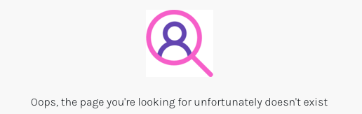

## Future features
These are a few examples of features that would increase the user experience for Movie Fav that I would like to implement in the future.

### Jumbotron
It would be nice to welcome the user with a short summery of the page.

### Profile image upload on sign up
User can add a profile image when signing up to Movie Fav, instead of adding one after signing in the first time. 

### Post owner can delete comments on their posts
User can delete unwanted comments by other users on their posts. 

## Responsive
Movie Fav is fully responsive for all screen sizes. 

# Components and hooks

## Components
Movie Fav contains components that can be used throughout the project.
- Asset: render a loading spinner, an image, and/or a message, set by the props. 
- Avatar: displays the users profile image.
- MoreDropDown: displays a dropdown menu for edit and delete functions.
- NavBar: displays the navbar at the top of the site, with navlinks displaying dynamically depending on user authorization.

## Hooks
Aside from the hooks included in the React library, Movie Fav contain two unique hooks that can be used throughout the project.
- useClickOutsideToggle: provides a convenient way to handle the closing of for example a menu by monitoring clicks outside the component.
- useRedirect: redirects the user depending on user authorization status. 

# Technology

## Languages
- JSX
- HTML
- CSS
- Javascript

## Frameworks
- React
- React bootstrap

## Other software and dependencies
- MSW 
- Axios
- React testing library
- npm 
- jwt-decode
- React lazy load image component

# Testing

## Automated tests
For this project I decided to focus on writing some automated tests for the NavBar component

Tests are written using React testing library MSW. All tests can be found **[here](src/components/__tests__/)**. Server setup can be found **[here](src/setupTests.js)**.

All automated tests have been run with npm and passed. 

## Manual testing
Movie Fav have been continualy tested manually troughout development and after deployment. A full summary of manual testing can be found [here](TESTING.md).

# Code validation

## Browser test
Movie Fav have been tested in Chrome and Firefox with no errors found in functionality.

### JSX
JSX code have been manually validated and adjusted throughout development via direct feedback from npm in the terminal. 

### CSS and React bootstrap
CSS and React bootstrap code have been manually validated and adjusted throughout development via direct feedback from npm in the terminal. 

## Lighthouse
Movie Fav have been tested using Chrome developer Lighthouse tester. Performance was quite impacted by large image sizes on all screen sizes, for signed in users, due to both post feed and profile avatars displaying. Performance was not impacted by the same issue on small and medium screens when signed out, because of the profile avatar images not displaying for signed out users on these screen sizes. 

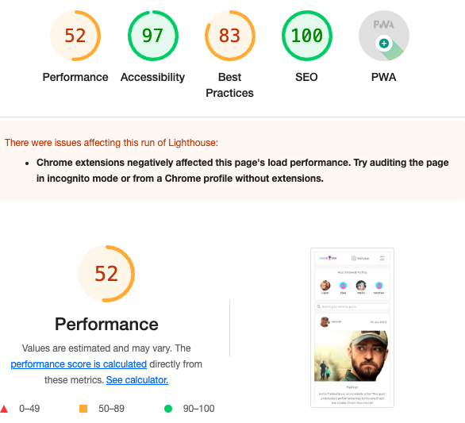

# Bugs
Not that I'm aware about

# Deployment
The master branch of this repository has been used for the deployed version of this application.

## Github and Gitpod
I created a repository in Github, named it ´movie fav´, and I used the template [Code-Institute-Org/react-ci-template](https://github.com/Code-Institute-Org/react-ci-template).

- Once the repository is created, click the green button to the right (Gitpod) to open a new Gitpod workspace.
- To open and work on the project it is best to open the workspace from Gitpod workspaces (rather than Github), this will open your previous workspace rather than creating a new one. You should pin the workspace.
- Committing changes should be done often and should have clear messages. Use the following commands to make your commits:
- git add . : adds all modified files to a staging area
- git commit -m "A message explaining your commit": commits all changes to a local repository.
- git push: pushes all your committed changes to your Github repository.
- While working on the project I used the Gitpod development server to view the website in action. To start the development server run the following command: npm start.

## Create a react project and app
- When opening the workspace the template will setup necessary files to run React. 
- Type `npm install` and `npm start` to start the React app. 
- Create a Procfile in the root directory and add `web: serve -s build`.   
- Folders for components, hooks, pages, contexts, css etc is created in the src directory.

## Heroku
- Log into Heroku or create an account.
- Click ´New´ create new heroku app. Give the app an app name and select your region, I chose Europe. 
- Under the project deploy tab, select GitHub for the deployment method. Search for the repository name and click connect. Scroll down to the manual deployment section and click deploy branch. Make sure you have the main branch selected. 

# Credits
- [CI Moments](https://github.com/Code-Institute-Solutions/moments)
- [Heroku](https://heroku.com/)
- [React bootstrap](https://react-bootstrap-v4.netlify.app/)
- [W3Schools](https://www.w3schools.com/)
- [Stackoverflow](https://stackoverflow.com/)
- [Cloudinary](https://cloudinary.com/)
- [Lucidchart](https://www.lucidchart.com/)
- [DrawSQL](https://drawsql.app/)
- [Google fonts](https://fonts.google.com/)
- [React documentation](https://react.dev/)
- [Get bootstrap](https://getbootstrap.com/)
- [Google](https://www.google.com/)
- [Flaticon](https://www.flaticon.com/)
- [Favicon generator](https://www.favicon-generator.org/)
- [Balsamiq](https://balsamiq.com/)
- [Iloveimg](https://www.iloveimg.com/)
- [Coolors](https://coolors.co/)
- [Looka](https://looka.com/)
- [Font awesome](https://fontawesome.com/)

# Acknowledgements
- Code institute tutor assistance for all help
- My cousin for all the conversations and encouragement
- My family for support and love
